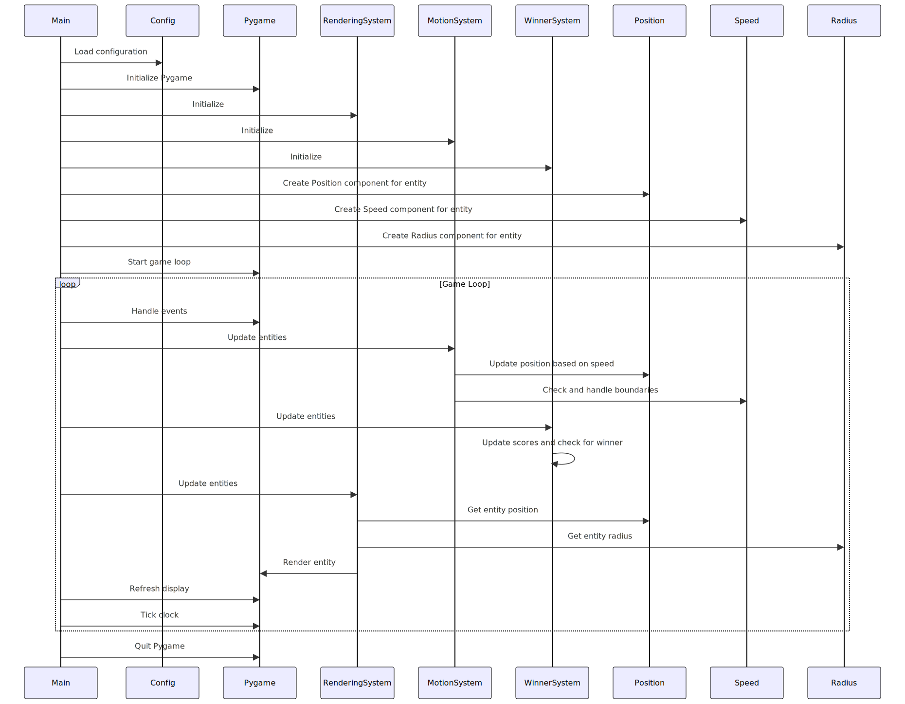

### Developer Documentation for [Project Name]
___

#### Table of Contents
1. **[Introduction](#1-introduction)**
2. **[Technical Specifications and Design](#2-technical-specifications-and-design)**
3. **[Architectural Overview](#3-architectural-overview)**
    - 3.1. [Architectural Diagrams](#31-architectural-diagrams)
    - 3.2. [Main Components Overview](#32-main-components-overview)
    - 3.3. [Modules Folder Structure](#33-modules-folder-structure)
    - 3.4. [Utilities Folder Contents](#34-utilities-folder-contents)
4. **[Development Guidelines and Standards](#4-development-guidelines-and-standards)**
5. **[Testing Framework and Coverage](#5-testing-framework-and-coverage)**
    - 5.1. [Testing Strategy Outline](#51-testing-strategy-outline)
    - 5.2. [Code Coverage Analysis](#52-code-coverage-analysis)
6. **[Versioning Information](#6-versioning-information)**
7. **[Performance Metrics and Optimization](#7-performance-metrics-and-optimization)**
8. **[Accessibility Considerations](#8-accessibility-considerations)**
9. **[Troubleshooting and FAQs](#9-troubleshooting-and-faqs)**
10. **[Best Practice Recommendations](#10-best-practice-recommendations)**
11. **[References and Further Reading](#11-references-and-further-reading)**
12. **[Feedback and Updates](#12-feedback-and-updates)**

---

#### 1. Introduction
Welcome to the official repository of our Ping Pong Game! This project brings the classic and exciting sport of table tennis to your screen, offering a fun and engaging experience for players of all skill levels. This documentation serves as a detailed guide to the development of ecs_ping pong. It is intended as a comprehensive resource for developers to understand and contribute effectively to the project.

---

#### 2. Technical Specifications and Design
- [Framework/Technology]:
  - Entities: Include components like `PositionComponent`, `Radius Component`, `RectComponent`, `SpeedComponent`, `WinnerComponent`.
  - Systems: Contains `MotionSystem`, `RenderingSystem` for handling different functionalities.
---

#### 3. Architectural Overview
- **3.1. Architectural Diagrams**
  - System Architecture
  
  - Class Diagram
  
  - Sequence Diagram
  
 

#### 3.2. Main Components Overview

 - components.py: Manages various components of game entities.

 - Purpose: Defines essential components like position, radius, rectangle, speed, and winner state for game entities.

 - systems.py: Manages the motion and rendering systems.

 - Function: Contains systems responsible for handling movement and rendering of game entities.

 - entities.py: Manages the entity framework.

 - Purpose: Defines the structure and behavior of game entities.

#### 3.3. Modules Folder Structure

 - position_component.py: Introduces PositionComponent.

 - Function: Represents the position of an object with x and y coordinates.

 - radius_component.py: Incorporates RadiusComponent.

 - Role: Represents a circular shape with a specified radius.

 - rect_component.py: Introduces RectComponent.

 - Function: Represents a rectangle with specific dimensions.

 - speed_component.py: Incorporates SpeedComponent.

 - Role: Represents the speed of an object in both x and y directions.

 - winner_component.py: Introduces WinnerComponent.

 - Function: Keeps track of the winner state in the game.

#### 3.4. Utilities Folder Contents

 - motion_system.py: Showcases MotionSystem.

 - Operation: Handles the movement of players, AI, and ball in the game.

 - endering_system.py: Contains RenderingSystem.

 - Mechanism: Responsible for drawing game entities like paddles and ball on the screen.

#### 4. Development Guidelines and Standards

  To ensure our Ping Pong Game remains consistent, maintainable, and high-quality, please follow these guidelines and standards when contributing:

  #### Architecture Adherence
  - **Entity-Component-System (ECS) Framework**: Our game is built using the ECS architectural pattern. Ensure that all integrations and modifications align with this pattern. This includes:
    - **Entities**: Represent game objects without behavior. Keep entities as simple as possible.
    - **Components**: Attach components to entities to define their data and behavior. Each component should be responsible for a single aspect of the entity.
    - **Systems**: Implement the logic that operates on entities' components. Systems should be modular and handle specific functionality (e.g., physics, rendering, input).

  - **Document your changes**: Provide clear documentation for any architectural changes or additions to facilitate understanding and future maintenance.

  #### Modularity
  - **Ensure code is modular**: Write modular code to promote reusability and ease of maintenance. Each system should have a single responsibility and be easily testable in isolation.
  - **Use clear interfaces**: Define clear interfaces for systems and components to interact with each other. Avoid tight coupling to ensure that changes in one system do not affect others.

  #### Code Standard
  - **Follow [Specific Coding Standard]**: Adhere to our specified coding standard to maintain code quality and readability. This includes:
    - Consistent naming conventions
    - Proper indentation and formatting
    - Commenting and documentation practices
    - Error handling and logging strategies
  - **Code Reviews**: All code changes must undergo a code review process. This helps maintain code quality and allows team members to share knowledge and catch potential issues early.

  #### Testing
  - **Write unit tests**: Ensure all new features and bug fixes are covered by unit tests. Aim for high test coverage to catch regressions and ensure reliability.
  - **Automated testing**: Integrate automated tests into the CI/CD pipeline to validate changes before merging them into the main branch.
  - **Test-driven development (TDD)**: When possible, use TDD practices to design and build robust, error-free code.

  #### Documentation
  - **Update documentation**: Whenever you add new features or make significant changes, update the relevant documentation to reflect these changes. This includes README files, inline comments, and any other project documentation.
  - **Clear commit messages**: Write clear and descriptive commit messages to provide context for changes and facilitate easier tracking of the project’s history.

  By following these guidelines and standards, we can ensure our Ping Pong Game codebase remains high-quality, maintainable, and scalable as it continues to evolve. Thank you for your contributions!

---

#### 5. Testing Framework and Coverage
- **5.1. Testing Strategy Outline**
  - **Unit Testing**: Using Pytest, located in the `tests/` directory.
---

#### 6. Versioning Information
- **Project Version**: 1.0.0
- **Python Version**: 3.10.13
- **Pygame Version**: 2.5.2
- **Pytest Version**: 8.2.1

#### 9. Troubleshooting and FAQs

  #### Q: The game crashes on startup.
  - **A**: Ensure you have all the required dependencies installed. Check the installation steps in the README. If the issue persists, verify that your Python and Pygame versions are compatible with the game.

  #### Q: The game runs, but the graphics are glitchy.
  - **A**: This could be due to outdated graphics drivers. Update your graphics drivers to the latest version. Additionally, check if there are any compatibility issues with your operating system.

  #### Q: The controls are not responding properly.
  - **A**: Verify that your input devices (keyboard or controller) are properly connected and recognized by your system. Make sure there are no conflicting software or background processes that might be interfering with the inputs.

  #### Q: The game is running slowly.
  - **A**: Ensure your system meets the minimum hardware requirements. Close any unnecessary applications running in the background to free up system resources. You can also try lowering the game’s graphics settings in the options menu.

  #### Q: I get an error when trying to run the game after pulling the latest changes.
  - **A**: Make sure you have the latest version of the dependencies by running `pip install -r requirements.txt`. If the issue continues, check the project's issue tracker on GitHub for any similar reported issues or open a new issue with detailed information.

  #### Q: How do I reset my game settings to default?
  - **A**: Locate the configuration file in the game directory and delete it. The game will create a new configuration file with default settings the next time it is launched.

  If your issue is not listed here or you need further assistance, please check our GitHub issue tracker or contact the development team for support.

---

#### 10. References and Further Reading
1. [Pygame Dcumentation](https://www.pygame.org/docs/) 

2. [Pytest Documentation](https://docs.pytest.org/en/latest/contents.html)
